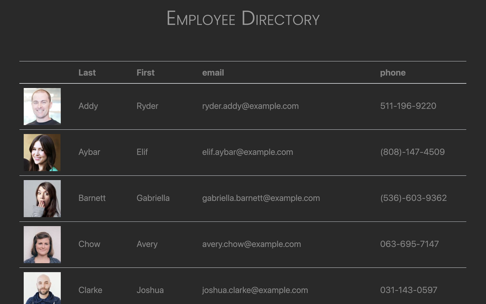

# React Employee Directory

## Description
This React directory is a modularized application that harnesses the magic of state to deliver swift and dynamic page interaction for its users. 

Visit the deployed application [here](https://polysnacktyl.github.io/react-directory/)

## Installation
This project was created with React; for guidance on setup and starting, visit [the documentation](https://reactjs.org/docs/create-a-new-react-app.html).

## Usage 
On page load, the application performs a GET request from [random-user's API](https://randomuser.me/) and displays a table populated with a hypothetial employee roster displaying a photo, name, email address, and phone numbers for each person. To sort alphabetically by first or last name, simply click "First" or "Last" in the table header. 

## Credit & References
[Guide to filtering in React](https://medium.com/crobyer/search-filter-with-react-js-88986c644ed5) written by [Bhavya Ambasta's](https://medium.com/@bhavya_51110). 

[Guide to table sorting in React](https://www.florin-pop.com/blog/2019/07/sort-table-data-with-react/) written by [Florin Pop](https://www.florin-pop.com/blog/2019/07/sort-table-data-with-react/);

A [Create React App](https://github.com/facebook/create-react-app) project.

## Contact 
polysnacktyl@gmail.com

